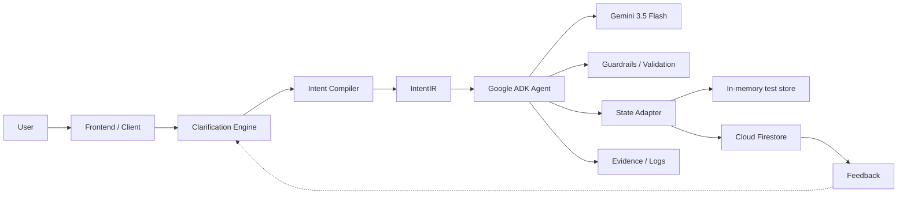

# YAXCHÉ IntentGuard — Architecture

## Goal

Convert messy human requests into structured intent, ask the minimum useful clarification when material ambiguity exists, and only then allow an agent workflow to continue.



## Components

### 1. Clarification Engine

A deterministic baseline detects obvious materially ambiguous requests. It is intentionally testable without a model or network access.

### 2. IntentIR

A typed representation preserves:

- original request;
- normalized goal;
- constraints;
- unknowns;
- success criteria;
- material-ambiguity state;
- clarification question when required.

### 3. Google ADK agent

The ADK root agent is instructed to compile intent before proposing action and to stop for clarification when the structured result says ambiguity is material.

### 4. Gemini

The configured hackathon model target is `gemini-3.5-flash`. Live inference is not considered proven until evidence is captured.

### 5. Storage

A memory adapter supports deterministic unit tests. A Firestore adapter is the planned persistent Google Cloud path. Adapter presence alone is not proof that Firestore has been used in a deployed environment.

### 6. Cloud Run

The deployment manifest targets Cloud Run. A deployed service URL, Cloud Run console/log evidence, and a reproducible command record are required before `CLOUD_RUN_DEPLOYMENT_PROVEN=true`.

## Authority boundary

```text
INTENT_UNDERSTOOD != USER_AUTHORIZATION
MODEL_PROPOSAL != EXECUTION_PERMISSION
CAPABILITY_AVAILABLE != AUTHORIZATION
```

## Hackathon-new-work boundary

IntentGuard is a new standalone implementation started on 2026-08-26. Prior YAXCHÉ/CADIPHI work is disclosed as conceptual lineage. Exact source-code reuse, if introduced later, must be provenance-recorded.
